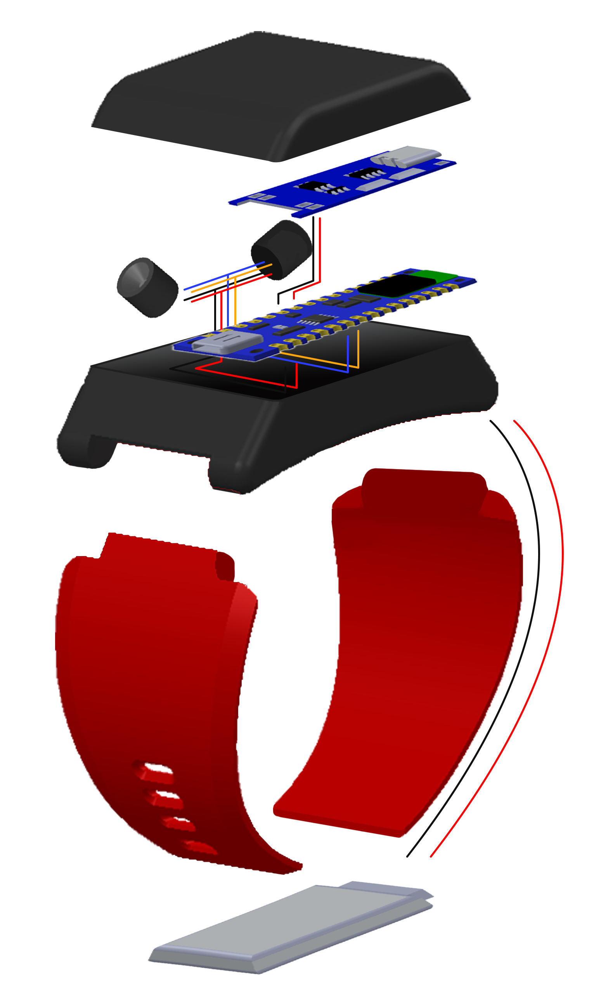

안녕하세요. 경희대학교 기계공학과를 졸업하고, SSAFY에서 개발 공부를 진행중인 장한걸입니다. 
이 페이지에는 제가 살면서 진행해 온 프로젝트나, 개인작들이 포함되어 있습니다. 
각 프로젝트에 대한 요약과 간략한 설명으로 이루어져 있으며, 자세한 사항은 각 항목마다 링크로 연결되어 있습니다. 
링크를 클릭할 시 프로젝트의 세부사항으로 연결되며, 프로젝트 진행 과정 및 세부 기술들을 확인하실 수 있습니다.
{:.note}

0. replaced with contents table
{:toc}

# #1 Burn Protection Method
> 사이버-물리 시스템을 이용한 영유아의 화상방지를 위한 화상방지 알고리즘 및 스마트밴드 제작.

#### Intro
이 프로젝트는 2020.09 ~ 2021.11 까지 진행된 프로젝트로, 영유아의 화상을 방지하고,
더 나아가 이를 구현한 열원 접근 감지 프로토콜을 배포함으로써, 다양한 화상의 위험이 있는 환경에서 

### 사용 기슬
- Arduino
- 

간단한 설명.
링크
엥 이거 줄바꿈이 안되냐?

* [detail_Burn_Protection_Method]{:.heading.flip-title} --- 자세히 보기
* [Github_Burn_Protection_Method]{:.heading.flip-title} --- 프로젝트 깃허브
{:.related-posts.faded}

[detail_Burn_Protection_Method]: Burn_Protection_Method.md
[Github_Burn_Protection_Method]: https://github.com/Hangeol-Chang/Burn_preventation_solution

# #2 Hexxagon
> 게임 제작 개인 프로젝트

#### Intro
이 프로젝트는, 1993년도 게임 Hexxagon을 모바일로 이식하는 것을 목표로 시작한 개인프로젝트로, 
개발 당시에도 동일한 게임이 모바일에 존재하였으나, 애니메이션의 부재, 디자인, 3인 모드의 부재 등의 아쉬움을 채우기 위해 
개발하게 되었습니다.