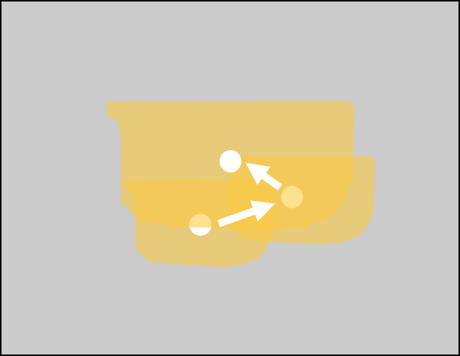
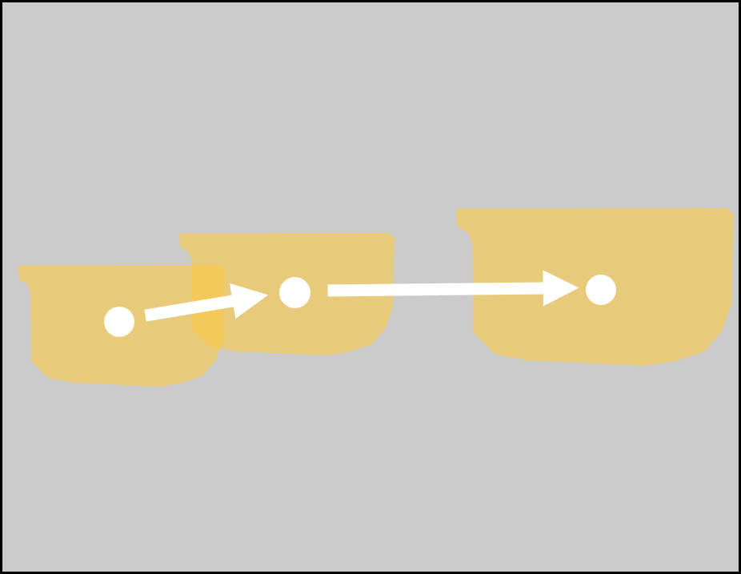
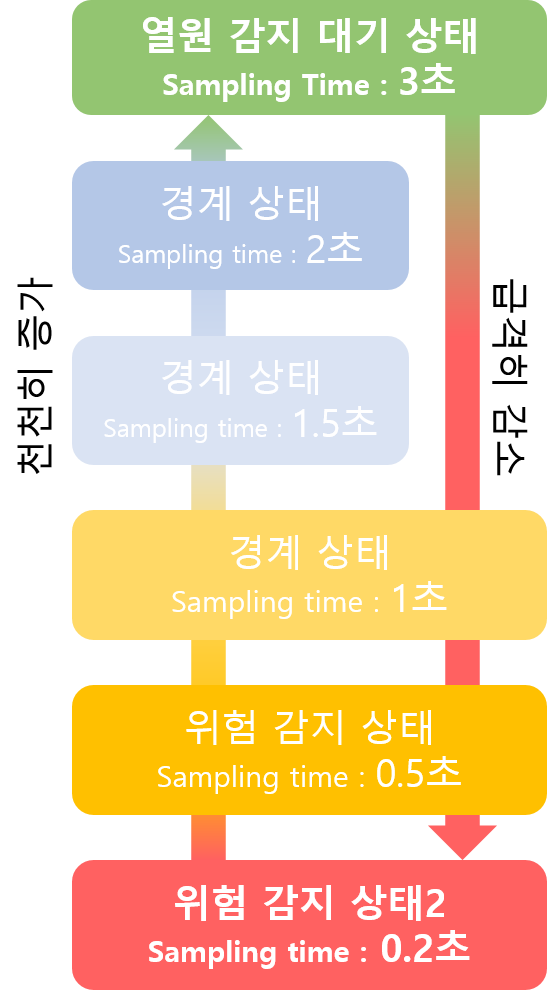

안녕하세요. 경희대학교 기계공학과를 졸업하고, SSAFY에서 개발 공부를 진행중인 장한걸입니다. 
이 페이지에는 제가 살면서 진행해 온 프로젝트나, 개인작들이 포함되어 있습니다. 
각 프로젝트에 대한 요약과 간략한 설명으로 이루어져 있으며, **자세한 사항은 각 항목마다 링크**로 연결되어 있습니다. 
링크를 클릭할 시 프로젝트의 세부사항으로 연결되며, 프로젝트 진행 과정 및 세부 기술들을 확인하실 수 있습니다.
{:.note}

0. replaced with contents table
{:toc}

# #1 Burn Protection Method
> 사이버-물리 시스템을 이용한 영유아의 화상방지를 위한 화상방지 알고리즘 및 스마트밴드 제작.

#### Intro
이 프로젝트는 2020.09 ~ 2021.11 까지 진행된 프로젝트로, 영유아의 화상을 방지하고,
더 나아가 이를 구현한 열원 접근 감지 프로토콜을 배포함으로써, 다양한 화상의 위험이 있는 환경에서 활용되어 화상 위험을 방지하는 것을 목표로 한다.

### 사용 기술
- Arduino (c++)
- mlx90640
- MIT APP Inventor
- 3D 프린트

### 기술 개요

- 두 개의 mlx90640을 이용하여 영유아의 전방 범위에서의 열원 접근을 판단하고, 열원의 접근을 판단하여 다양한 방식으로 경고를 발생한다.
- mlx90640의 화각은 110*60도로, 2개를 이용하여 사용자의 전 범위에 대한 열화상을 분석하기에는 무리가 있다. 하지만 카메라의 수를 늘리면 배터리타임에 큰 지장이 생기기에, 두 대의 mlx90640을 이용하여 사용자가 움직이는 범위를 최대한 감지할 수 있는 배치를 선정하였다.

 

- 열원의 접근을 판단하는 방법에 있어서, 사용자가 열원을 그저 지나가는 상황과, 열원에 접근하는 상황을 구분하는 알고리즘을 제작하여 사용하였다.

 

    

- 물체의 형상에 따라 물체가 접근할 때 변수의 변화 양상이 달라지며, 이를 구분할 수 있도록 물체의 형상에 따른 왜곡을 보정하는 알고리즘을 제작하였다.

 

    

- 배터리 최적화를 위해, 열원이 감지되지 않을 때는 4초당 한 번씩 샘플링을 진행하며, 열원이 감지되었을 때 급격하게 샘플링 타임을 감소시켜, 0.2초에 한 번씩 샘플링을 진행한다.

---

#### 자세히 보기

* [detail_Burn_Protection_Method]{:.heading.flip-title} --- 자세히 보기
* [Github_Burn_Protection_Method]{:.heading.flip-title} --- 프로젝트 깃허브
  {:.related-posts.faded}

[detail_Burn_Protection_Method]: Burn_Protection_Method.md
[Github_Burn_Protection_Method]: https://github.com/Hangeol-Chang/Burn_preventation_solution

 

---

# #2 Hexxagon
> 게임 제작 개인 프로젝트

#### Intro
이 프로젝트는, 1993년도 게임 Hexxagon을 모바일로 이식하는 것을 목표로 시작한 개인프로젝트로, 
개발 당시에도 동일한 게임이 모바일에 존재하였으나, 애니메이션의 부재, 디자인, 3인 모드의 부재 등의 아쉬움을 채우기 위해 개발하게 되었습니다.

현재는 구글플레이스토어에서 다운로드는 불가능하며, 깃허브 페이지에서 릴리즈된 베타버전을 다운받아 플레이해볼 수 있습니다.

### 사용된 기술

- Unity
- C#

### 게임 소개

 이 게임은 땅따먹기 형태의 보드게임이다.

육각형 형태의 타일이 벌집으로 늘어선 판에서 게임이 진행되며, 자신의 말을 늘리고 상대의 말을 먹어가며 자신의 땅을 넓혀가는 것이 목표인 게임이다.

아래는 게임 진행의 간단한 overview이다.

    

### 기술 개요

- 유니티엔진을 이용하여 플레이 가능한 보드게임을 제작.
- 벌집 모양의 맵을 구현하고, 다양한 맵 형태를 만들기 위해 일부를 타일을 제거하여야 한다.
  이를 위해서 기초가 되는 많은 양의 타일을 미리 깔아두고, 맵 번호를 입력받아 필요 없는 타일을 지우도록 하였다. 이 방법을 사용해서 얻은 장점과 단점이 각각 존재한다.
  - 장점 : 간단하게 숫자를 입력하는 것으로 새로운 맵을 추가할 수 있다.
  - 단점 : 미리 정해놓은 사이즈로 맵의 최대 크기가 제한된다. 이를 수정하기 위해선, 모든 맵의 정보를 수정해야 한다.
  
- 

AI를 만들기 위해

---

#### 자세히 보기

* [detail_Hexxagon]{:.heading.flip-title} --- 자세히 보기
* [Github_Hexxagon]{:.heading.flip-title} --- 프로젝트 깃허브
  {:.related-posts.faded}

[detail_Hexxagon]: Hexxagon.md
[Github_Hexxagon]: https://github.com/Hangeol-Chang/Burn_preventation_solution

 

---

# #3 Lucid(Maplestory fangame)

> 게임 제작 개인 프로젝트

#### Intro

이 프로젝트는, 메이플스토리에 있는 '루시드'라는 보스몬스터를 플레이어블하게 디자인하기 위해 시작된 메이플스토리의 팬게임 제작 개인 프로젝트입니다.

### 사용된 기술

- Unity
- C#
- MVC 패턴

### 기술 개요

몬스터가 발판에서 떨어지지 않는 것.

---

#### 자세히 보기

*[mlx90640]: 열화상 카메라